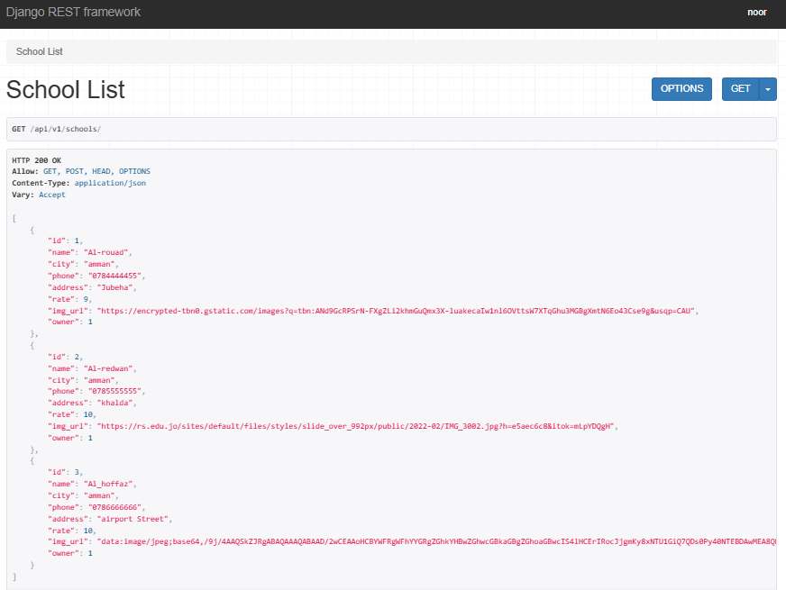
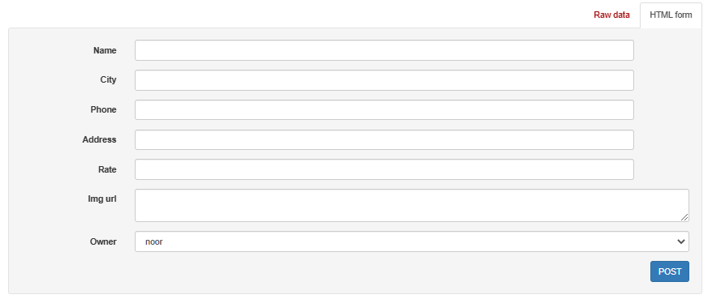
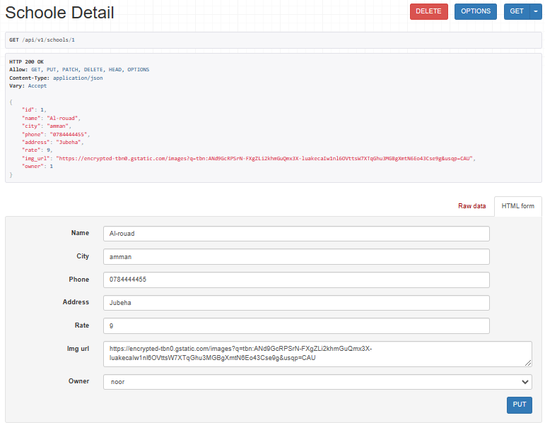

# SchoolApp-DjangoREST

## LAB-25

## Project: School-DjangoREST-API

**Author: Noor Alkhateeb**

I Use Django REST Framework to create an School API, then "containerize" it with Docker.

**/api/v1/schools/** URL

1. API-list objects

2. API-create objects

3. API-update or delete specific object **/api/v1/schools/_id_**

**Run:**

> python3 manage.py runserver

**update the database:**
python manage.py makemigrations
python manage.py migrate

